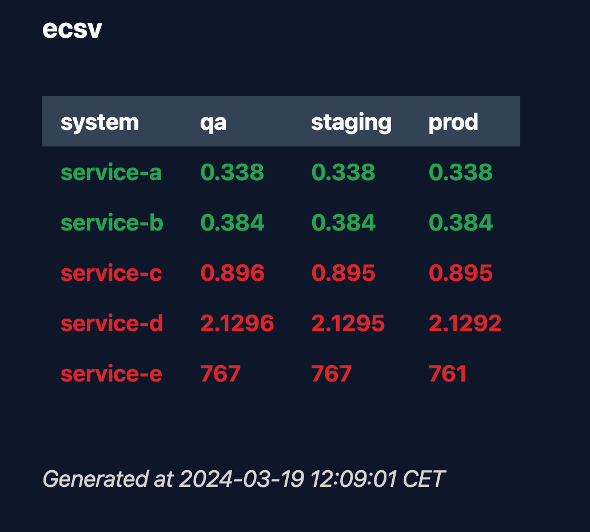

# ecsv

[](https://github.com/dhth/ecsv/actions/workflows/build.yml)
[](https://github.com/dhth/ecsv/actions/workflows/vulncheck.yml)
[](https://github.com/dhth/ecsv/releases/latest)
[](https://github.com/dhth/ecsv/releases)

`ecsv` helps you quickly check the versions of your systems running in ECS tasks
across various environments.

<p align="center">
  
</p>


💾 Installation
---

**homebrew**:

```sh
brew install dhth/tap/ecsv
```

**go**:

```sh
go install github.com/dhth/ecsv@latest
```

⚡️ Usage
---

Create a configuration file that looks like the following.

```yaml
env-sequence: ["qa", "staging"]
systems:
- key: service-a
  envs:
  - name: qa
    aws-config-source: profile:::qa
    aws-region: eu-central-1
    cluster: 1brd-qa
    service: service-a-fargate
    container-name: service-a-qa-Service
  - name: staging
    aws-profile: qa
    aws-config-source: profile:::staging
    aws-region: eu-central-1
    cluster: 1brd-staging
    service: service-a-fargate
    container-name: service-a-staging-Service
- key: service-b
  envs:
  - name: qa
    aws-config-source: profile:::qa
    aws-region: eu-central-1
    cluster: 1brd-qa
    service: service-b-fargate
    container-name: service-b-qa-Service
  - name: staging
    aws-config-source: profile:::staging
    aws-region: eu-central-1
    cluster: 1brd-staging
    service: service-b-fargate
    container-name: service-b-staging-Service
```

By default, `ecsv` will try to find the config file at `~/.config/ecsv.yml`.

### Output Formats

Besides being in TUI mode, `ecsv` can also output data in plaintext and HTML
formats.

```bash
ecsv -format=plaintext
ecsv -format=html
```

Using the latter will output HTML that, when served, looks as follows:

<p align="left">
  
</p>

Read more about outputting HTML in the [examples](./examples/html-template)
directory.
